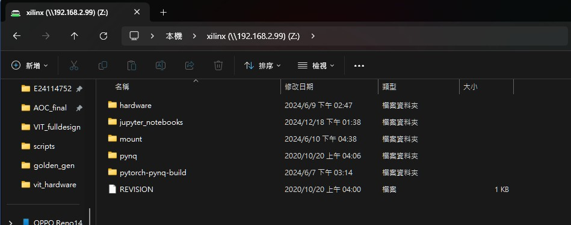
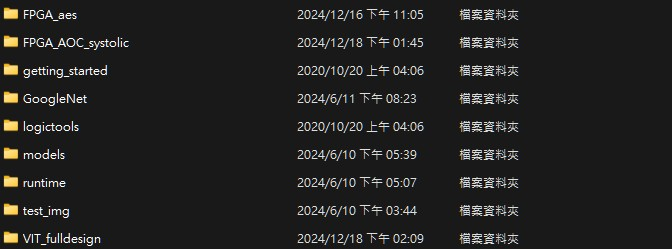
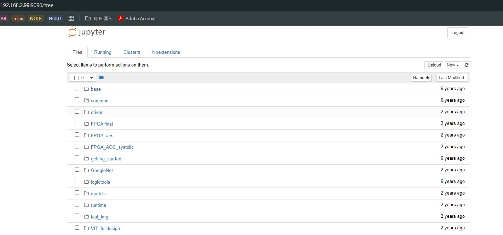
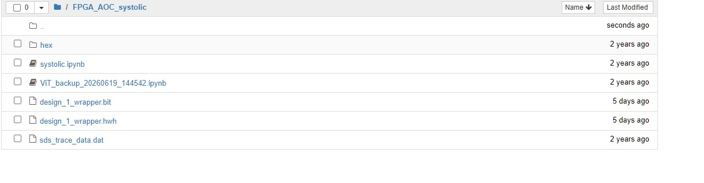
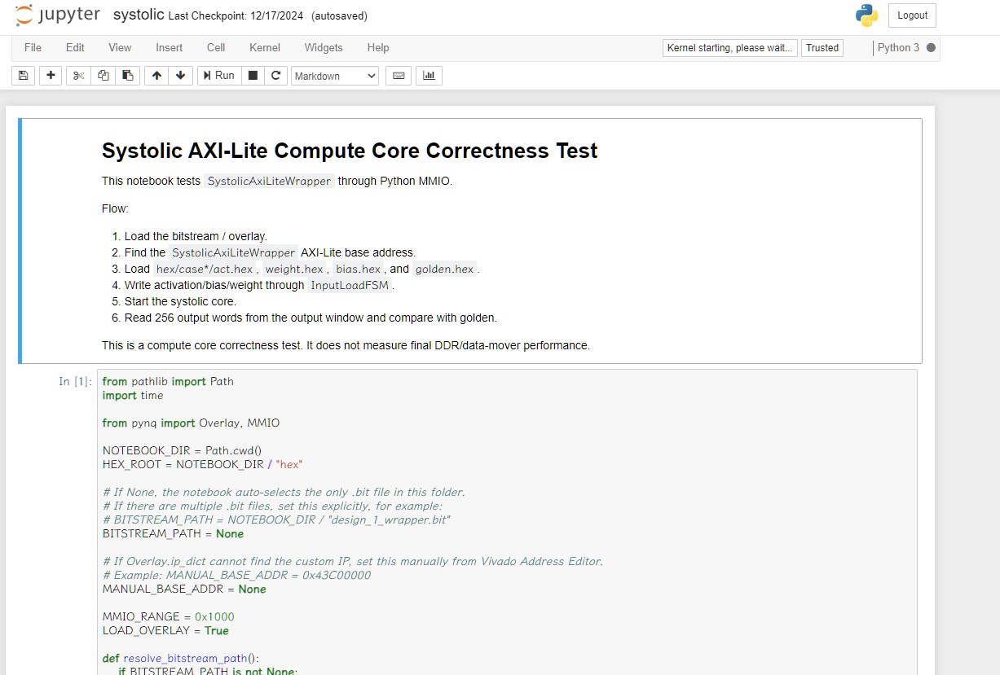

# FPGA README

本資料夾主要放置 AOC Final Project 在 FPGA 上驗證需要的檔案，包含 FPGA bitstream、hardware handoff file、Python Notebook 測試程式、RTL code 與 測資。

整體分成兩個部分：

1. **Systolic Array Unit Test**：單獨驗證 systolic array IP 是否可以在 FPGA 上正確運算，直接由 python code 寫 data 進 BRAM。
2. **Full Design**： ViT Accelerator one block 設計整合 FPGA 上的 DDR 來模擬 RTL 與 DRAM 溝通驗證。

---

# 1. 通俗介紹：怎麼使用 FPGA

> [!IMPORTANT]
> **只要 FPGA 成功開機、電腦成功連線到 Jupyter Notebook，就可以直接按 `Run` 執行 Python code。**
>
> 因為本資料夾已經放入硬體需要的：
>
> - `design_1_wrapper.bit`
> - `design_1_wrapper.hwh`
>
> 所以使用者只要進入 Jupyter Notebook，打開對應的 `.ipynb`，就能透過 Python 和 FPGA 上的硬體互動。
>
> 以下步驟主要是通俗介紹我們實際在 FPGA 上部署與測試的流程。

---

## 1.1 FPGA 開機與連線流程

### Step 1：將開機模式調整至 SD

將 FPGA 板子的 Boot Mode 調整到 **SD** 的位置，代表系統會從 micro SD 卡開機。

---

### Step 2：調整電源供應模式

依照供電方式調整 jumper：

- 使用電源供應器供電：接 **REG**
- 使用 USB 供電：接 **USB**

---

### Step 3：插入 micro SD

將已經燒好 PYNQ image 的 micro SD 卡插入 FPGA。

---

### Step 4：接上電源

接上 FPGA 電源，但先不要急著操作。

---

### Step 5：插上乙太網路線

將乙太網路線一端接 FPGA，另一端接筆電。

```text
FPGA  <------ Ethernet Cable ------>  Laptop
```

---

### Step 6：開機

打開 FPGA 電源後，先等待板子完全開機。

開機時板子的 RGB LED 會先閃彩燈，等到四顆 LED 全亮紅燈或綠燈時，代表板子已經完全開機完成。

---

## 1.2 Windows 網路設定

在 Windows 上依序開啟：

```text
網路和共用中心
  -> 變更介面卡設定
  -> 乙太網路
  -> 內容
  -> IPv4
  -> 內容
```

將 IP 設定為：

```text
IP Address：192.168.2.1
Subnet Mask：255.255.255.0
```

---

## 1.3 確認是否成功連線 FPGA

在檔案總管輸入：

```text
\\192.168.2.99\xilinx
```

帳號與密碼皆為：

```text
Username：xilinx
Password：xilinx
```

如果可以成功連進去，並看到：

```text
\xilinx\jupyter_notebooks
```

就代表 FPGA 已經成功開機，而且筆電也成功連線到 FPGA。






---

## 1.4 從 Vivado XSA 取出 bitstream 與 hwh

Vivado 完成 bitstream 產生後，可以 export 出 `.xsa` 檔案。

使用以下任一壓縮軟體開啟 `.xsa`：

- 7-Zip
- WinRAR

從 `.xsa` 中取出：

```text
design.bit
design.hwh
```

或是 Vivado 產生的名稱可能會是：

```text
design_1_wrapper.bit
design_1_wrapper.hwh
```

接著放到 FPGA 的 Jupyter Notebook 資料夾中，例如：

```text
\\192.168.2.99\xilinx\jupyter_notebooks\design
```

資料夾內至少需要有：

```text
design/
├── design_1_wrapper.bit
├── design_1_wrapper.hwh
└── systolic.ipynb
```

---

## 1.5 撰寫並執行 ipynb

Python Notebook 會負責和 FPGA 上的硬體互動，包含：

- 載入 bitstream
- 透過 `.hwh` 找到硬體 IP
- 使用 MMIO 存取 AXI-Lite register
- 將 activation、weight、bias 寫入 FPGA BRAM
- 啟動 Systolic Array
- 讀回 output
- 和 golden result 比對

撰寫好的 `.ipynb` 也放在同一個 design 資料夾內。

---

## 1.6 開啟 Jupyter Notebook

打開瀏覽器，輸入：

```text
192.168.2.99:9090
```

預設密碼：

```text
xilinx
```

登入後進入自己建立的 design 資料夾，打開 `.ipynb`，直接按 `Run` 或 `Run All` 即可執行 FPGA 測試。








---

# 2. Systolic Array Unit Test

本章節介紹單獨在 FPGA 上驗證 Systolic Array 的 unit test。

這個測試的目標不是驗證完整 ViT accelerator，而是先確認 systolic array IP 在 FPGA 上可以正確做到：

```text
Activation x Weight + Bias = Output
```

Python Notebook 會把測試資料寫進 FPGA BRAM，啟動 Systolic Array，最後讀回 256 筆 output，並和 `golden.hex` 比對。

---

## 2.1 systolic_RTL 資料夾架構

```text
systolic_RTL/
├── ActivationMem.v
├── BiasMem.v
├── InputLoadFSM.v
├── OutputCaptureFSM.v
├── OutputMem.v
├── Systolic.v
├── SystolicAxiLiteWrapper.v
├── SystolicSystemCore.v
├── WeightMem.v
└── WeightPingPongController.v
```

> 此圖為目前 `systolic_RTL/` 的資料夾內容。


---

## 2.2 RTL Module 說明

| 檔案 | 功能說明 |
| --- | --- |
| `Systolic.v` | Systolic Array 核心運算模組，負責讀取 activation、weight、bias，執行 tile-based GEMM，並輸出 opsum。 |
| `SystolicSystemCore.v` | 系統整合核心，將 Systolic core、input loader、BRAM、weight ping-pong、output capture 串接在一起。 |
| `SystolicAxiLiteWrapper.v` | AXI-Lite wrapper，讓 Python 可以透過 MMIO 寫 register、載入資料、啟動運算、讀回狀態與結果。 |
| `ActivationMem.v` | Activation BRAM template，提供 activation 的 32-bit word 讀寫介面。 |
| `WeightMem.v` | Weight BRAM template，提供 weight 的 32-bit word 讀寫介面。 |
| `BiasMem.v` | Bias BRAM template，提供 bias 的 32-bit word 讀寫介面。 |
| `InputLoadFSM.v` | Host/Python 端資料載入 FSM，透過 AXI-Lite 寫入 activation、weight、bias。 |
| `WeightPingPongController.v` | Weight ping-pong buffer 控制器，讓 weight 可以使用 double buffering，減少等待時間。 |
| `OutputCaptureFSM.v` | 擷取 Systolic Array 輸出的 256 筆 opsum，並依序寫入 output memory。 |
| `OutputMem.v` | Output BRAM template，讓 Python 可以讀回硬體計算結果。 |

---

## 2.3 與原本 Systolic Array 的差異

原本的 Systolic Array README 中，主要模組只有：

```text
src/
├── Act_fifo.v
├── Opsum_acc.v
├── PE_pack.v
└── Systolic.v
```

原本的設計比較像是 RTL simulation 使用的 systolic core，testbench 直接模擬 BRAM 行為，並且一次給 128-bit data。

這次 FPGA 版本為了能真的放到 PYNQ / FPGA 上執行，因此做了以下修改。

---

### 修改 1：BRAM data width 從 128-bit 改為 32-bit

原本 testbench 模擬的 BRAM 是：

```text
128-bit / word
```

也就是一次讀取一整列 128-bit 的資料。

但在這次 FPGA 實作中，為了符合目前 BRAM / AXI-Lite 搬資料的方式，改成：

```text
32-bit / word
```

因此 RTL 內部會連續讀取四筆 32-bit word，再組回原本 Systolic Array 需要的 128-bit row。

簡單來說：

```text
原本：
1 cycle 讀 128-bit

FPGA 版本：
連續讀 4 個 32-bit word
再組成 1 個 128-bit row
```

這樣雖然資料載入需要更多 cycle，但比較符合 FPGA BRAM 與 Python MMIO 寫入資料的方式。

---

### 修改 2：新增 BRAM template

原本 simulation 中，BRAM 是在 testbench 內用 reg array 模擬。

FPGA 版本新增了實際可合成的 memory module：

```text
ActivationMem.v
WeightMem.v
BiasMem.v
OutputMem.v
```

這些模組在 simulation 時可以用 reg array，在 synthesis 時則會對應到 FPGA 上的 BRAM template。

---

### 修改 3：新增 InputLoadFSM

原本測試資料大多由 testbench 直接餵給硬體。

FPGA 版本需要讓 Python 透過 AXI-Lite 把資料寫進硬體，因此新增：

```text
InputLoadFSM.v
```

它使用簡單的 register-like 介面：

```text
CTRL  ：開始載入，以及選擇 target
BASE  ：寫入起始 address
COUNT ：要寫入幾筆 32-bit word
DATA  ：實際寫入的 data word
```

target 目前包含：

```text
0：activation
1：bias
2：weight
```

---

### 修改 4：新增 AXI-Lite Wrapper

為了讓 Python Notebook 可以控制 FPGA 硬體，新增：

```text
SystolicAxiLiteWrapper.v
```

此模組負責把 AXI-Lite transaction 轉成內部控制訊號，例如：

- 設定 `k_tile_cnt`
- 設定 activation base address
- 設定 weight base address
- 設定 bias base address
- 啟動 systolic array
- 讀取 status
- 讀取 output
- 讀取 profiling counter

---

### 修改 5：新增 Output Capture 與 Output Memory

Systolic Array 會連續輸出 256 筆 opsum。

FPGA 版本新增：

```text
OutputCaptureFSM.v
OutputMem.v
```

流程如下：

```text
Systolic opsum output
        ↓
OutputCaptureFSM
        ↓
OutputMem
        ↓
Python MMIO read back
```

Python 最後會從 output memory 讀回 256 筆資料，並與 `golden.hex` 比對。

---

### 修改 6：新增 Weight Ping-Pong Controller

為了減少 weight loading 造成的等待時間，FPGA 版本新增：

```text
WeightPingPongController.v
```

概念是使用兩個 weight buffer：

```text
Buffer A：目前 systolic 正在讀取
Buffer B：下一個 tile 的 weight 正在載入
```

當下一個 tile 載入完成後，兩個 buffer 交換角色。

這樣可以讓 loading 和 compute 有機會重疊，減少 systolic array 等 weight 的時間。

---

### 修改 7：新增硬體計數器

FPGA 版本也加入一些硬體 profiling counter，方便觀察效能，例如：

- total cycles
- compute busy cycles
- weight load cycles
- overlap cycles
- weight stall cycles
- activation BRAM reads
- weight BRAM reads
- bias BRAM reads
- output word writes

這些 counter 是從 RTL 內部量測，不是 Python 估出來的。

---

## 2.4 FPGA_AOC_systolic 資料夾架構

```text
FPGA_AOC_systolic/
├── hex/
├── design_1_wrapper.bit
├── design_1_wrapper.hwh
├── sds_trace_data.dat
└── systolic.ipynb
```

> 此圖為目前 `FPGA_AOC_systolic/` 的資料夾內容。


---

## 2.5 FPGA_AOC_systolic 檔案說明

| 檔案 / 資料夾 | 說明 |
| --- | --- |
| `hex/` | Unit test 測資，沿用原本 Systolic Array 測試那邊提供的資料，包含 activation、weight、bias、golden output。 |
| `design_1_wrapper.bit` | Vivado 產生的 FPGA bitstream，Python Notebook 會透過 PYNQ Overlay 將它載入 FPGA。 |
| `design_1_wrapper.hwh` | Hardware handoff / hardware description file，提供 PYNQ 解析 IP、register map、address map 使用。 |
| `systolic.ipynb` | FPGA unit test 的 Python Notebook，負責載入 bitstream、寫入測資、啟動硬體、讀回 output 並比對 golden。 |
| `sds_trace_data.dat` | PYNQ / Vitis 相關 trace data，主要作為 profiling 或工具產生的輔助檔案。 |

---

## 2.6 hex 測資說明

`hex/` 內的測資是從原本 Systolic Array unit test 延伸使用的資料。

每個 case 通常會包含：

```text
act.hex
weight.hex
bias.hex
golden.hex
```

其中：

- `act.hex`：activation input
- `weight.hex`：weight input
- `bias.hex`：bias input
- `golden.hex`：正確答案，用來和 FPGA output 比對

Python Notebook 會依照 case 設定讀取這些檔案，並透過 AXI-Lite / MMIO 寫入硬體。

---

## 2.7 systolic.ipynb 執行流程

`systolic.ipynb` 的主要流程如下：

```text
1. 載入 bitstream
2. 透過 .hwh 找到 SystolicAxiLiteWrapper IP
3. 建立 MMIO 物件
4. 讀取 hex/case*/act.hex、weight.hex、bias.hex、golden.hex
5. 將 activation 寫入 ActivationMem
6. 將 bias 寫入 BiasMem
7. 將 weight tile 寫入 WeightMem / Ping-Pong Buffer
8. 設定 k_tile_cnt、base address
9. 啟動 Systolic Array
10. 等待硬體完成
11. 讀回 256 筆 output
12. 和 golden.hex 比對
13. 印出 PASS / FAIL 與硬體 counter
```

通過時會看到類似：

```text
case1: PASS
case2: PASS
case3: PASS
case4: PASS
ALL PASS
```

---

# 3. Full Design

> [!NOTE]
> **TBD**

Full design 目前尚未補上完整說明。

之後此章節預計補充：

- Full ViT Accelerator 架構
- Dataflow
- Layer Scheduler
- DMA / Memory Map
- Systolic Array 與 PPU / RMSNorm / Softmax 的整合方式
- Full design Python control flow
- Full design FPGA validation result

---

# 4. 建議 Repo 結構

建議 `FPGA/` 資料夾整理如下：

```text
FPGA/
├── README.md
├── images/
│   ├── fpga_network_setting.png
│   ├── fpga_windows_share.png
│   ├── jupyter_home.png
│   ├── jupyter_design_folder.png
│   ├── jupyter_run_notebook.png
│   ├── systolic_RTL_structure.png
│   └── FPGA_AOC_systolic_structure.png
│
├── systolic_RTL/
│   ├── ActivationMem.v
│   ├── BiasMem.v
│   ├── InputLoadFSM.v
│   ├── OutputCaptureFSM.v
│   ├── OutputMem.v
│   ├── Systolic.v
│   ├── SystolicAxiLiteWrapper.v
│   ├── SystolicSystemCore.v
│   ├── WeightMem.v
│   └── WeightPingPongController.v
│
└── FPGA_AOC_systolic/
    ├── hex/
    ├── design_1_wrapper.bit
    ├── design_1_wrapper.hwh
    ├── sds_trace_data.dat
    └── systolic.ipynb
```
