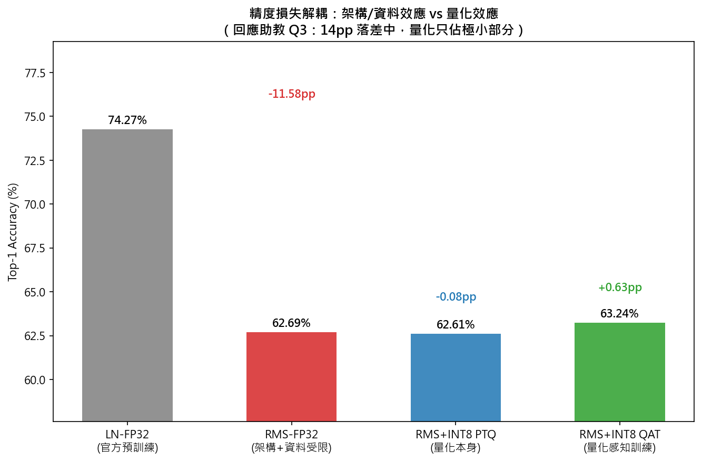
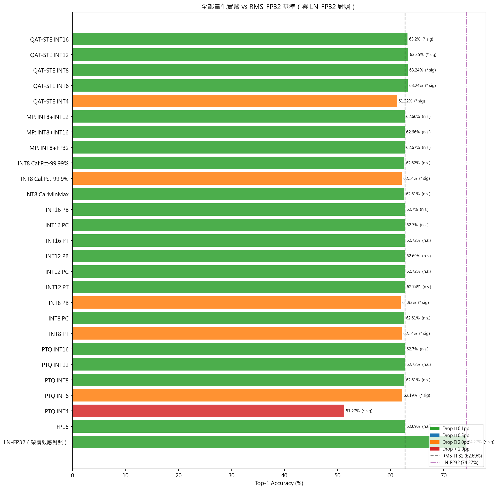
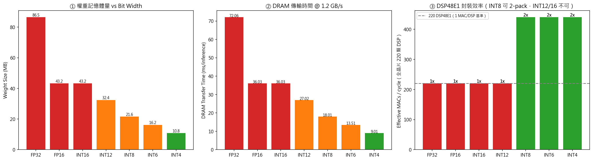
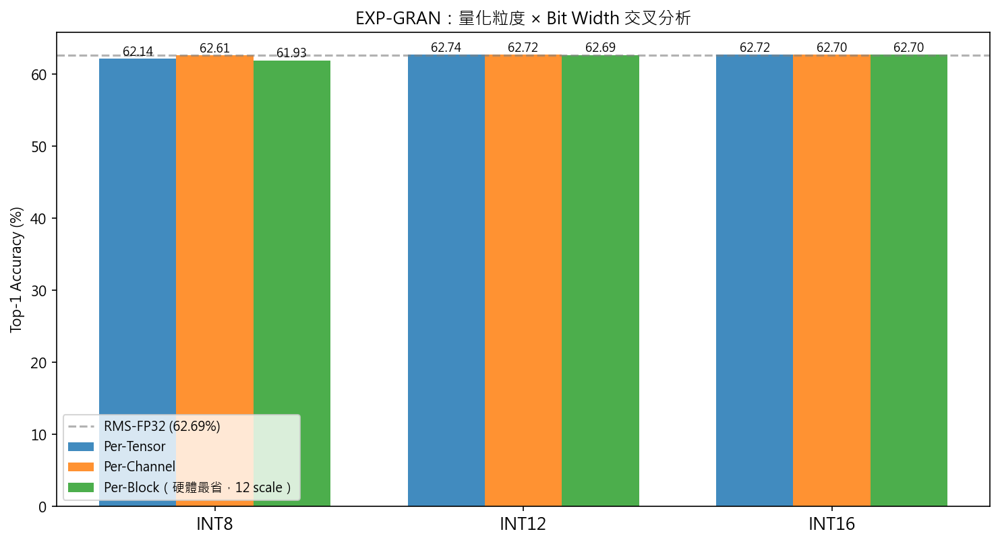
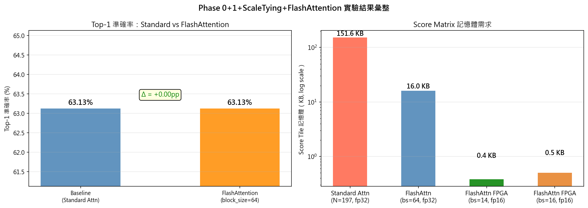

# 軟體端模型驗證 (Model / Software-side Verification)


> 「ViT model optimization」第 1~6 節
> 這個資料夾收錄的是「軟體端的驗證」實驗——也就是在 DLA RTL 開始設計之前，用 Python/PyTorch 驗證模型架構（RMSNorm）、量化方法（PTQ/QAT、Scale Tying、Bit-Width）與 FlashAttention 是否可行、精度代價多少的全部 notebook。

## 1. 摘要：這個資料夾在驗證什麼

依照專案實際時間順序，軟體端驗證分兩個階段：

1. **CIFAR-10 / LayerNorm 階段（Proposal 期）**：模型還是原始 LayerNorm 版本，目的是快速篩選「量化方法」（PTQ MinMax vs Percentile vs KL、QAT-STE vs QAT-LSQ），確認哪種方法硬體上做得到、精度上站得住。
2. **ImageNet-1k 子集 / RMSNorm 階段（期末期）**：模型換成 RMSNorm（硬體更省），重新做 INT8 量化、Residual Scale Tying 粒度消融、FlashAttention 數學等價性驗證，以及最後回應助教追問的 Bit-Width Policy（INT4~INT16）系統性消融。

所有數字與結論已經整理進書面報告的「ViT model optimization」章節，這裡的 notebook 是**產生那些數字的原始程式碼**，方便助教或統整的同學追溯/重跑。

## 2. 最終結果總表

> 原始圖檔/CSV 都在 [`results/`](./results) 資料夾。

**補充探討與實驗**：原始口頭報告把「74%→62%」的下降全部歸因於 INT8 量化，但拆解後發現量化本身只造成 0.08pp 損失，真正的主因是 RMSNorm 架構替換＋訓練資料受限（-11.58pp）；系統化測試 INT4~INT16 後，確認 INT8+QAT 在精度與硬體成本（DSP 吞吐量、DRAM 頻寬）之間是最佳選擇。

| 階段 | 設定 | Top-1 (%) | 說明 |
|---|---|---:|---|
| 架構基準 | LayerNorm FP32（官方預訓練） | 74.27 | 未動過的 ViT-Small/16 |
| 架構替換 | RMSNorm FP32（7-epoch 微調） | 62.69 | -11.58pp，主因：架構替換＋資料量受限 |
| + 量化 | RMSNorm + INT8 PTQ | 62.61 | 量化本身只多掉 0.08pp |
| + 量化感知訓練 | RMSNorm + INT8 QAT | 63.13~63.24 | 反超 FP32(RMSNorm) 基準 |
| Bit-Width 上限測試 | INT16 QAT | 63.20 | 比 INT8 沒有顯著增益（McNemar p>0.05），但 DSP 吞吐量砍半 |
| FlashAttention | vs 標準 Attention | Δ=0.00 | 數學嚴格等價，SRAM 從 151.6KB→0.4KB（379×） |

**圖表**：

| 圖檔 | 說明 |
|---|---|
|  | 精度損失拆解瀑布圖：架構替換 -11.58pp vs 量化僅 -0.08pp |
|  | 全部 26 組量化方案（不同 bit width × 粒度 × 校準）橫向比較，橘/紅色標出統計顯著下降的組合 |
|  | INT12/16 vs INT8 的硬體代價：權重量、DRAM 傳輸時間、DSP48E1 有效 MAC/cycle |
|  | Per-Tensor / Per-Channel / Per-Block（Scale Tying）在 INT8/12/16 下的精度差異 |
|  | FlashAttention vs 標準 Attention 準確率與 Score Matrix 記憶體需求對比 |

原始數據另存於 [`results/full_summary.csv`](./results/full_summary.csv)（全部 26 組實驗）與 [`results/mcnemar_all.csv`](./results/mcnemar_all.csv)（統計顯著性檢定）。

## 3. 環境建立

實驗是在以下環境跑出來的（notebook Cell 0/Cell 1 都有印出版本資訊，可比對）：

```text
conda 環境名稱：aoc2026_lab1
Python   : 3.12.3
PyTorch  : 2.9.1+cu128
timm     : 1.0.26
CUDA     : True
GPU      : NVIDIA GeForce RTX 5060
```

建議直接用 conda 建立同名環境，再用 [`requirements.txt`](./requirements.txt) 安裝套件（版本是從 `aoc2026_lab1` 實際匯出的，比單純 `pip install` 最新版更嚴謹、可重現）：

```bash
conda create -n aoc2026_lab1 python=3.12.3
conda activate aoc2026_lab1
pip install -r requirements.txt
pip install jupyterlab ipykernel   # 若要在本機開 notebook
```

> [!NOTE]
> `requirements.txt` 只列出這 7 個 notebook **實際 import** 到的套件（torch/timm/transformers/datasets/scikit-learn/scipy/pandas/matplotlib/seaborn/tqdm 等）。`aoc2026_lab1` 環境本身還裝了 tensorflow、jupyterlab 等其他課程作業用的套件，這裡不列入，避免裝一堆無關依賴。

如果沒有 CUDA GPU，`02`、`03`、`04`、`05`、`06` 的訓練/微調 cell 會變得非常慢（`03` 的 7-epoch 微調在 RTX 5060 上約需數十分鐘），建議至少準備一張可用 CUDA 的 GPU。

## 4. 資料集準備

| 資料集 | 用在哪些 notebook | 取得方式 |
|---|---|---|
| CIFAR-10 | `00`、`01` | `torchvision.datasets.CIFAR10(root="./data", download=True)`，第一次執行會自動下載到 notebook 所在目錄的 `./data/cifar-10-batches-py` |
| ImageNet-1k 驗證子集 | `02`、`03`、`04`、`05`、`06` | 需自備本地資料夾 `IMAGENET_VAL_HF`（46,429 張影像、1000 類），固定以 `SEED=42` 做 80/20 stratified split（訓練 36,720／測試 9,709／校準 1,000）。**此資料夾因檔案過大不放進 GitHub**，請依下方教學自行從 Hugging Face 下載重建 |

### 4.1 從 Hugging Face 下載 ImageNet 並轉成 notebook 需要的格式

notebook 是用 `torchvision.datasets.ImageFolder` 讀取資料，**不是**直接呼叫 `datasets.load_dataset()`，所以下載下來後要轉成「每個類別一個資料夾」的格式：

```text
IMAGENET_VAL_HF/
  00000/   ← class_idx = 0 的所有圖片
  00001/   ← class_idx = 1
  ...
  00999/
```

**步驟：**

1. 到 [huggingface.co/datasets/ILSVRC/imagenet-1k](https://huggingface.co/datasets/ILSVRC/imagenet-1k) 登入並接受授權條款（這是 gated dataset，需要 HF 帳號同意授權才能下載）。
2. 產生 Access Token（Settings → Access Tokens），並登入 CLI：

    ```bash
    pip install huggingface_hub
    huggingface-cli login   # 貼上你的 token
    ```

3. 執行下載 + 轉換腳本（存成 `prepare_imagenet_val.py` 後執行一次即可）：

    ```python
    import os
    from datasets import load_dataset

    OUT_DIR = "./IMAGENET_VAL_HF"
    ds = load_dataset("ILSVRC/imagenet-1k", split="validation")  # 50,000 張

    for i, ex in enumerate(ds):
        label = ex["label"]
        class_dir = os.path.join(OUT_DIR, f"{label:05d}")
        os.makedirs(class_dir, exist_ok=True)
        ex["image"].convert("RGB").save(os.path.join(class_dir, f"{i:06d}.jpg"))
        if i % 1000 == 0:
            print(f"{i}/{len(ds)}")
    ```

4. 把 notebook 裡的 `IMAGENET_VAL_DIR` 改成指向這個 `IMAGENET_VAL_HF` 資料夾的絕對路徑（見下一節）。

> [!NOTE]
> 官方 ImageNet-1k validation split 共 50,000 張（每類 50 張）。我們實驗用的「46,429 張」是這份資料再過濾掉少量無法讀取/異常格式的圖片後的結果，數字可能因下載批次略有差異。但 notebook Cell 3 的 `SEED=42` stratified split 邏輯是固定的，只要餵進同一批圖片，切分比例與訓練/測試/校準集大小都會一致，**不影響各方法之間的相對結論**（量化/RMSNorm/Bit-Width 的相對精度排序不會變）。

## 5. 已知問題：notebook 內有寫死的絕對路徑

> [!WARNING]
> 這些 notebook 是直接從工作目錄搬過來的，**裡面還留著原電腦上的絕對路徑**（例如 `C:\Users\User\Desktop\AOC_Final\...`），搬到別的機器或別的資料夾位置後**無法直接執行**，必須先手動修改以下變數再執行：

| 變數 | 出現在 | 應該改成 |
|---|---|---|
| `IMAGENET_VAL_DIR` | `02`、`03`、`04`、`05`、`06` | 你自己的 `IMAGENET_VAL_HF` 資料夾絕對路徑 |
| `CKPT_DIR` | 全部 | 建議改成相對路徑，例如 `"./ckpt_xxx"`，並確保跟下一節「checkpoint 依賴鏈」描述的目錄名稱一致 |
| `PREV_CKPT_DIR` | `04`、`05`、`06` | 指向 `03` 產生的 `ckpt_rms_quant` 資料夾 |

建議統一用 `Find & Replace` 把絕對路徑換成相對路徑（相對於你放 `IMAGENET_VAL_HF` 與 `ckpt_*` 資料夾的位置），這樣之後才能真正做到「複製這個資料夾就能重現實驗」。

## 6. 執行順序與 Checkpoint 依賴鏈

**重要**：`03` 之後的 notebook 都依賴 `03` 訓練出來的 `ckpt_rms_quant/rms_stage_b.pt`（RMSNorm 兩階段微調後的權重，~88MB，未包含在本資料夾內，需自行執行 `03` 產生，或向學長索取檔案）。執行順序如下：

```text
00 ──(獨立，CIFAR-10)
01 ──(獨立，CIFAR-10)

02 ──(獨立，ImageNet，僅示範 zero-shot 崩潰，不產生後續依賴的 checkpoint)

03 ──(ImageNet，7-epoch Stage A+B 微調 + INT8 PTQ/QAT)
  │   產生 ckpt_rms_quant/rms_stage_a.pt、rms_stage_b.pt  ← 核心 checkpoint
  │
  ├──> 04（讀 rms_stage_b.pt，做 Scale Tying 粒度消融）
  ├──> 05（讀 rms_stage_b.pt，做 FlashAttention 驗證）
  └──> 06（讀 rms_stage_b.pt，做 Bit-Width Policy 消融）
```

也就是說，若要重現 `04`／`05`／`06` 的任何結果，**必須先成功跑完 `03`**，並確認 `ckpt_rms_quant/rms_stage_b.pt` 存在；否則這三個 notebook 會在載入 checkpoint 的 cell 直接報錯。

## 7. 各 Notebook 對應的實驗與結論

| Notebook | 對應報告章節 | 驗證內容 | 關鍵結論 |
|---|---|---|---|
| `00_quant_method_screening_cifar10.ipynb` | 第 2 節 | PTQ MinMax vs Percentile-99.9% vs KL Divergence、QAT-STE vs QAT-LSQ，以及逐層敏感度分析（EXP-SA） | MinMax 幾乎無損（-0.03pp）且硬體最簡單；KL 崩潰（-15.88pp）；LSQ 訓練不收斂；識別出 13/50 高敏感層 |
| `01_rmsnorm_replacement_cifar10.ipynb` | 第 3 節 | 在 CIFAR-10 上初步驗證 LayerNorm → RMSNorm 替換 | 確認直接替換會崩潰，需要微調 |
| `02_rmsnorm_zeroshot_demo_imagenet.ipynb` | 第 3 節 | 在 ImageNet 上示範 RMSNorm zero-shot（不微調）崩潰到 ~1% | 證明架構替換後**必須**微調 |
| `03_rmsnorm_int8_quant_imagenet.ipynb` | 第 3、4 節 | 完整 7-epoch Stage A（凍結底層）+ Stage B（LLRD 全層微調），再做 INT8 PTQ/QAT + Residual Scale Tying 設計 | RMSNorm 微調後 62.69%；INT8 PTQ 只多掉 0.08pp；QAT 後反超 FP32 基準 |
| `04_scale_tying_ablation_imagenet.ipynb` | 第 4 節 | Per-Tensor / Per-Channel / Per-Block（Scale Tying）量化粒度消融 | INT8 下 Per-Block 比 Per-Channel 多掉 ~0.7pp，INT12 以上幾乎無差異 |
| `05_flashattention_validation_imagenet.ipynb` | 第 5 節 | FlashAttention（Tiling + Online Softmax）數值與精度驗證 | 精度 Δ=0.00pp，SRAM 縮 379×，最大誤差 6.53e-08，可作 RTL golden data |
| `06_bitwidth_policy_ablation_imagenet.ipynb` | 第 6 節 | INT4/6/8/12/16 完整消融（PTQ、QAT、校準策略、混合精度、McNemar 檢定、硬體成本） | 回答助教 Q3：「掉 10 幾 %」主因是架構替換不是量化；INT12/16 換回的精度多數統計不顯著，且 DSP 吞吐量砍半，故維持 INT8+QAT |

## 8. 與其他資料夾的關係

* 書面報告完整論述與所有數字的最終彙整版（「ViT model optimization」章節）。
* 本資料夾**不包含** `ckpt_*` checkpoint 資料夾（每個 `.pt` 約 88MB，不適合放進 Git），需要的人請自行執行對應 notebook 重新訓練，或另外用雲端硬碟分享。
* 若要重現 DLA / FPGA 章節提到的 golden data 或 LUT 統計範圍（`sum_sq` / `inv_rms`），來源同樣是 `03`、`05` 這兩個 notebook 內收集的統計量，細節見書面報告第 3、5 節。
* `results/` 內的圖表與 CSV 皆由 `06_bitwidth_policy_ablation_imagenet.ipynb`（圖 01~04）與 `05_flashattention_validation_imagenet.ipynb`（圖 05）執行後自動產生，可直接重新執行對應 notebook 更新。
