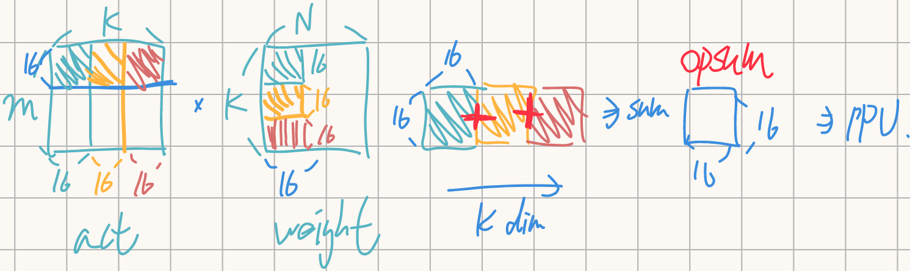

# Systolic asrray README
[TOC]
## module info
包含以下四個module
```
src
├── Act_fifo.v
├── Opsum_acc.v
├── PE_pack.v
└── Systolic.v
```
### FPGA驗證注意事項
1. BRAM
    - tb中的
        ``` v
        // tb/Systolic_tb.sv
        // ================ 模仿 BRAM 行為, 加上BRAM後拿掉 ================
        reg [127:0] act_bram [4096:0];
        reg [127:0] w_bram [4096:0];
        reg [127:0] bias_bram [3:0];                //32', 16 bias
        reg [127:0] act_latch;                      //data晚addr一個cycle
        reg [127:0] w_latch;                        //data晚addr一個cycle
        reg [127:0] bias_latch;
        // ==============================================================
        ```
        分別用weight / activation / bias BRAM換掉
    - BRAM配置成 128 bit per word, 單次讀寫128 bit
    - 會同時讀取weight, activation, bias, 3個要分開放在不同BRAM
    - 存取BRAM相關的 Control signal
        - base_addr
            ``` v
            // src\Systolic.v
            input [16:0] act_base_addr, // BRAM total: 4096 * 140 B, / 8B per word, 17' addr
            input [16:0] w_base_addr,
            input [16:0] bias_base_addr,

            ```
            - 整個[M, K] by [K, N] 的GEMM input matrix的base address
            - 完成GEMM過程中會依序讀取 `base_addr +1`, ..., `base_addr + (K-1)`
        - bram_valid
            ``` v
            // src\Systolic.v
            input act_bram_valid,   //controller給
            input w_bram_valid,     //controller給
            input bias_bram_valid,  //controller給
            ```
            BRAM對應到`act_bram_addr`, `w_bram_addr`, `bias_bram_addr`的[16, 16] matrix已經完成載入時, tb要給1
    - 到BRAM 的I/O port
        ```v
        // src\Systolic.v
        output [16:0] act_bram_addr, 
        output [16:0] w_bram_addr,
        output [16:0] bias_bram_addr,

        input [127:0] act_bram_row,     //input data
        input [127:0] w_bram_row,       //input data
        input [127:0] bias_bram_row,    //input data
        ```
        - addr: width可以改小, 目前是先用最大值, 可存取所有板上的BRAM space
2. 測資
    - 都在`hex/`下, 共有5個case, 詳情看`hex/hex_gen.ipynb`
        - 對應到的資料筆數就是該次測試需要的BRAM depth
        - act, weight最大需要的depth是1536
        - bias bram固定為depth是4 (實際可以配置的更大 但單次乘法只會用到4)
    - BRAM只需要存`weight.hex`, `act.hex`, `bias.hex`
    - golden.hex直接讀取後與opsum比對
3. 資源info
    - 是不是map到約128個DSP
        - PE_pack都是1個DSP, 共128個
        - 其他邏輯可能也會map到DSP, 但是不多
    - PE之間的bypass output map到DSP的cout port, 而非由外部繞線
        - `W1_bypass` => DSP `ACOUT`
        - `act_bypass` => DSP `BCOUT`
    - 確認case4 的BRAM用量
        - 把整張act[16, 1536], weight[1536, 16]連續存在同一塊BRAM是否合理
        - 由DRAM load act[16, 1536], weight[1536, 16]所需的cycle數
    - 其他cycle, power報告

### IO spec
- Top level module: Systolic.v, 所有對外接口都由Systolic.v包裝
- I/O spec
    1. Control signal & config
        ``` verilog
        input en,
        output reg module_ready,      // module able to use
        
        input [16:0] act_base_addr, // BRAM total: 4096 * 140 B, / 8B per word, 17' addr
        input [16:0] w_base_addr,
        input [16:0] bias_base_addr,
        input [6:0] k_tile_cnt //at most 96, at FC2
        ```
        - en
            - 需要執行GEMM時要給`en` = 1'b1, 在收到Systolic.v回傳的`module_ready`後`en`可變回0
        - module_ready
            - Systolic array已經可以執行下個大循環時, `ready` = 1'b1
            - en與ready同時為high時會開始執行一個大循環
        - 其他配置,在en=1時config要同時傳送, en與ready同時為high時會成功傳入Systolic.v
            - act_base_addr
                - 這個大循環的第一組activation address
            - w_base_addr
                - 這個大循環的第一組activation address
            - k_tile_cnt
                - 這個大循環包含多少個k-tile
                - i.e.16 by 16 GEMM的次數
                - eg: QKV Projection 為例 `act[197, 384]` by `weight[384, 1152]`, 對應就是ceil(384/16) = 24次
    2. BRAM相關 (Systolic.v直接存取BRAM)
        ```v
        output [16:0] act_bram_addr, 
        output [16:0] w_bram_addr,
        output [16:0] bias_bram_addr,

        input act_bram_valid,       //controller給
        input w_bram_valid,         //controller給
        input bias_bram_valid,      //controller給

        input [127:0] act_bram_row, //input data
        input [127:0] w_bram_row,   //input data
        input [127:0] bias_bram_row,//input data
        ```
        - BRAM的 word配置成`128'`, 單次讀取拿到`128'`
        - addr, data傳輸行為與SRAM相同, cycle 0傳addr, cyc1要拿到值
            - addr: width可以改小, 目前是先用最大值, 可存取所有板上的BRAM space
            - data: 128'
        - act_bram_valid, w_bram_valid, bias_bram_valid
            1. 由controller or tb控制, BRAM中對應到 `act_bram_addr`, `w_bram_addr`, `bias_bram_addr`的[16, 16] matrix已經完成載入時給1
            2. enable之後大循環內的`k_tile_cnt` 個`[16, 16]` by `[16, 16]` GEMM都要從bram載w, act進入FIFO/PE
                - 只有第一次需要載入bias
            2. 每次載入[16, 16] weight, activation前Systolic都會檢查valid, w, act兩者都valid時才會開始載入資料
                - 第一次也會檢查bram_valid
                - 防止bram還沒load完所需資料, systolic就去存取
            3. valid只需要1個cycle, 然後會連續讀完[16, 16], 中間不會再檢查valid
                - i.e. 至少要確保[16, 16] by [16, 16]的`w`, `act`, `bias`各自在同個bram上連續存放
                    - eg: 不能`w[1~12, 16]`在bram1, `w[13~16, 16]`在bram2
            4. 直到算下個`[16, 16]` by `[16, 16]`時才再次檢查valid
    3. To PPU
        ```v
        output opsum_valid,
        output [31:0] opsum
        ```
        - valid同時會給一個opsum, 總共會有256個, 連續給256個cycle
### module 行為
1. 單次大循環(`enable` 1次)可執行`act[16, k]` by `weight[k, 16]`
2. 其中k為任意16的倍數
3. 對應到的`[16,16]`by `[16, 16]`GEMM次數為 k/16 次
4. ex: `act[16, 48]` by `weight[48, 16]`
    總共會執行3次 `[16,16]` by `[16, 16]` GEMM
    >

    1. 第1次算 `act[1~16, 1~16]` by `weight[1~16, 1~16]`
    2. 第2次算 `act[1~16, 17~32]` by `weight[17~32, 1~16]`
    3. 第2次算 `act[1~16, 33~48]` by `weight[33~48, 1~16]`
    4. 三次累加之後就得到[16 by 16] opsum, 並輸出到PPU
5. ex2: 以Vit的QKV Projection 為例 `act[197, 384]` by `weight[384, 1152]`
    1. 需要`enable` ceil(197/16) * ceil(1152/16)次
    2. 每次`enable` 都執行`act [16, 384]` by `weight [384, 16]`
        - 384/16 = 24次`[16,16]` by `[16, 16]` GEMM, 產出 `opsum[16, 16]`, 送至PPU

### sub-module
1. Act_fifo.v
2. Opsum_acc.v
    - 累加不同k - tile的psum
3. PE_pack.v
    - PE unit, 處理2個weight對一個activation的MAC
    - map到一個DSP
    - 總共用128個